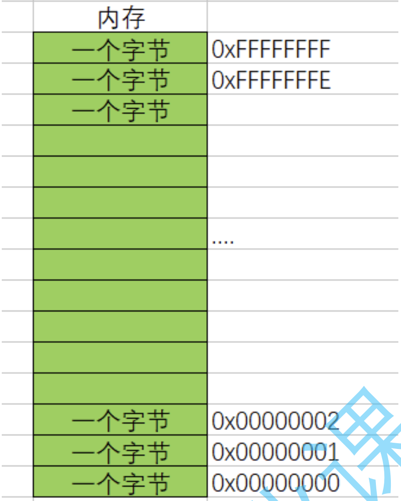
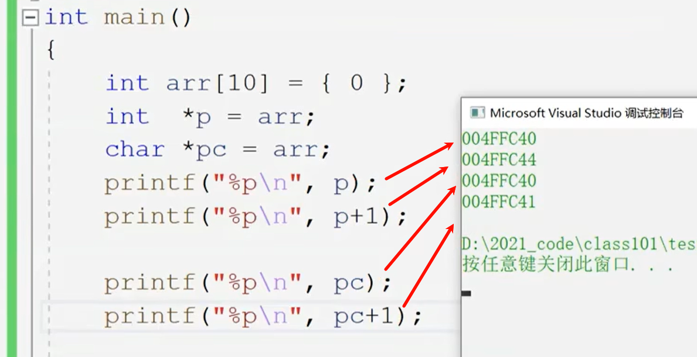

# C语言学习笔记

---

---

1. 一种预处理指令，以免在输入scanf时报错(如下)
   `#define  _CRT_SECURE_NO_WARNINGS 1`
2. 基本变量算数程序(如下)

```C
#include <stdio.h>
int main()
{
 double a1, b2, c3, sum;
 scanf("%lf%lf%lf", &a1, &b2, &c3);        //这里会被系统认定为是不安全的数据，因此需要第一行的代码
 sum = a1 * b2 / c3;
 printf("%f",sum);  
 return 0;
}
```

3. scanf在使用时可能会被编译器认为是不安全的代码，需要改为scanf_s或是在第一行加上1.的语句
4. if语句下如果只是跟一条语句时不需要加上{}，两句及以上则需要
5. 关于字符数组的说明
   (1)字符串就是一串字符——用双引号括起来的一串字符
   (2)字符串在结尾的时候隐藏了一个\0的字符，例如“hello”有6个元素
   (3)"\0"是字符串的结束标志，但是在计算字符长度的时候不做字符内容
6. 关于数组的定义和引用(如下)

```C
#include <stdio.h>
int main()
{
 int arr[5] = { 0,2,4,6,8 }; 
 //上面这一行数组名称为arr，该数组包含5个整型元素
 int i = 0;
 while (i < 5)
 {
  printf("%d\n", arr[i]);
  i++;
 }
 return 0;
}
```

```text
数组定义方式：数组名[常量表达式]
值得注意的是——这里数组arr中，各个元素所对应的序号应是从0开始而不是从1开始
打印arr中的第3个元素（4），引用的应该为arr[2]
```

7. 关于sizeof的讲解(如下)

```C
#include<stdio.h>
int main()
{
   int a = 10;
   int b = 20;
   int dic[4] = { 2,3,5,7 };
   printf("%d\n", sizeof(a));
   printf("%d\n", sizeof a );       //同上一行代码一个意思，但是a可以不用带括号
   printf("%d\n", sizeof(b));
   printf("%d\n", sizeof b );       //同上上一行一样
   printf("%d\n", sizeof(int));     //计算int类型所占的大小
   printf("%d\n", sizeof(dic));     //4个元素也是4个变量，计算的是数组中所有元素所占的字节
   printf("%d\n", sizeof(int [10]));//int [10]是arr数组类型
   return 0;
}
```

```text
sizeof的作用：计算类型或变量或数组的大小
这串代码说明了sizeof为一个单目操作符而不是函数,后面跟变量时可以不用加括号
结果上来说除了最后一行输出的都是4,因为一个整型变量需要占4个字节（1字节=8bit）
在sizeof中放的表达式是不参与运算的,也不会修改变量的类型
```

8. 关键字
   由C语言提供的关键字，但是不能由自己创建
9. define的作用
   (1)定义常数。如#define ABC 1000 （这里不需要等号）
   (2)定义宏。如#define ADD(X,Y) X+Y，在后面再次使用宏时，直接把字符替换成数字即可（如4+7）
   *注：*
   (1)定义宏的时候（拿上一行做例子），在(X+Y)后面的式子中， X+Y与((X)+(Y))是有区别的
   (2)不加括号会默认按照数学里的四则运算进行
10. switch语句

```C
#include <stdio.h>
int main()
{
	char grade;
	scanf("%c", &grade);
	printf("Your score:");
	switch (grade)
	{
	   case 'S':printf("perfect"); break;
	   case 'A':printf("good");    break;
	   case 'B':printf("bad");     break;
	   case 'C':printf("worst");   break;
	   default:printf("ERROR");
	}
	return 0;
}
```

```text
值得注意的是：在执行一个case语句后，应当用break语句使流程跳出switch结构，即终止运行
不过最后一个case不需要break，因为switch结构已经结束
```

---

11. 函数的组成(示例如下)

```C
ret_type fun_name(para1, *)
{
   statement;//语句项
}
//ret_type   ——>返回类型
//fun_name   ——>函数名
//para1      ——>函数参数
//大括号整体称为函数体
```

12. 操作符
    分类:算术操作符,移位操作符,位操作符,赋值操作符,单目操作符,关系操作符,逻辑操作符,条件操作符,逗号操作符,下标引用、函数调用和结构成员.
13. 算术操作符: + - * / %
    (1)除了 % 操作符之外,其他的几个操作符可以作用于整数和浮点数.
    (2)对于 / 操作符如果两个操作数都为整数,执行整数除法.而只要有浮点数执行的就是浮点数除法.
    (3)% 操作符的两个操作数必须为整数.返回的是整除之后的余数.
14. 原码,补码与反码
    (1)原码:直接根据数值写出的二进制序列就是原码
    (2)反码:原码的符号位不变,其他位按位取反就是反码
    (3)补码:反码 +1 就是补码
    (4)对于正整数来说,原码、反码、补码相同;负数如下示例:

```txt
举例:
十进制数-1
原码: 1000000000000000000000000000001
反码: 1111111111111111111111111111110
补码: 1111111111111111111111111111111
```

---

15. 移位操作符: 左移操作符"<<" 和右移操作符">>"
    (1)左移操作符的作用是把变量的二进制位向左移动一位;右移操作符相反.
    (注:此行为不会直接改变原变量的值)
    (2)左移操作符
    过程为:左边抛弃,右边补0(逻辑左移)
    (3)右移操作符
    a.算术右移:右边丢弃,左边补原符号位
    b.逻辑右移:右移丢弃,左边补0
    右移操作符采用的是算术右移
    注:不能移动负数位
16. 位操作符: 按位与"&", 按位或"|", 按位异或"^"
    (1)按位与
    两个二进制位都是1才输出1,有一个0就输出0
    (2)按位或
    两个二进制位有一个是1就输出1,都是0才输出0
    (3)按位异或
    a.两个二进制位相同输出为0,相异输出为1
    b. a^0 的结果为a; a^a 的结果为0. (变量a为整数)
    注:他们的操作数必须是整数

```text
示例:
a =    十进制位:3
       二进制位:00000000000000000000000000000011
b =    十进制位:5
       二进制位:00000000000000000000000000000101

a & b =十进制位:1
       二进制位:00000000000000000000000000000001
a | b =十进制位:7
       二进制位:00000000000000000000000000000111
a ^ b =十进制位:6
       二进制位:00000000000000000000000000000110
```

17. 赋值操作符: "=", "+=", "-=", "*=", "/=", "<<=", "%="  ......
    (1)除去"=",其它都是复合赋值
    (2)赋值操作符可以连续赋值,例如 `z=y=x+1`
18. 单目操作符
    (1)包含:逻辑反操作"!", 负值"-", 正值"+", 取地址"&", 操作数的类型长度(以字节为单位)"sizeof", 对一个数的按位取反" ~ ", 自加"(前置/后置) ++", 自减"(前置/后置) --", 直接引用操作符(解引用操作符)" * ", 强制类型转换"()"
    (2)逻辑反操作"!": 0的逻辑反操作为1,非0的逻辑反操作为0; 常跟在变量或"="前面
    (3)操作数的类型长度(以字节为单位)"sizeof": 详见第7条
    (4)按位取反"~": 将该变量的补码转换成反码
    (5)取地址操作符"&": 读取变量
    (6)直接引用操作符(解引用操作符)"*": 又成为间接访问操作符,放在变量前,使指针变量间接地控制地址对应的变量
19. 变量的存储形式
    变量在内存中以补码的形式存储.因此在二进制运算的时候要先将原码转换成补码的形式
20. **指针**(重点)
    (1)指针的大小:为4字节(x86)或者8字节(x64),不随变量属性的变化而变化,而是随编译器的变化而变化(x86/x64)
21. 转义字符

| 转义字符 |                        释义                        |
| :------: | :------------------------------------------------: |
|   \\?    | 在书写连续多个问号时使用，防止他们被解析成三字母词 |
|   \\'    |                 用于表示字符常量'                  |
|   \\"    |           用于表示一个字符串内部的双引号           |
|   \\\    |  用于表示一个反斜杠，防止它被解释为一个转义序列符  |
|    \a    |                   警告字符，蜂鸣                   |
|    \b    |                       退格符                       |
|    \f    |                       进纸符                       |
|    \n    |                        换行                        |
|    \r    |                        回车                        |
|    \t    |                     水平制表符                     |
|    \v    |                     垂直制表符                     |
|   \ddd   |  d d d表示一个1~3个八进制的数字.如: \130表示字符X  |
|   \xdd   |    d d表示2个十六进制数字。 如： \x30 表示字符0    |

22. 指针
    (1)指针是什么?
        a.指针是内存中一个最小单元的编号，也就是地址
        b.平时口语中说的指针，通常指的是指针变量，是用来存放内存地址的变量
    * 具体地说,在计算机科学中,**指针**是编程语言中的一个对象,利用地址,它的值直接指向存在电脑存储器中另一个地方的值.由于通过地址能找到所需的变量单元,可以说,地址指向该变量单元.因此,将地址形象化地称为"指针".意思是通过它能找到以它为地址的内存单元.
    可以这样理解: 
    指针实际使用如下:
    ```C
    int main()
    {
        int a = 10;         //a在这里占4个字节
        int* pa = &a;       //拿到的是a的4个字节中第一个字节的地址
        //a变量占用4个字节的空间,这里是将a的4个字节的第一个字节的地址存放在p变量中,p就是一个之指针变量.
        *pa = 20;           //通过*pa直接修改a的值
        return 0;
    }
    ```

    (2)指针的定义:[变量类型]+[*]+[space]+[名称]
        a. char* 类型的指针是为了存放char类型变量的地址
        b. short* 类型的指针是为了存放short类型变量的地址
        c. int* 类型的指针是为了存放int类型变量的地址
    (3)指针的大小: 在32位平台是4个字节,在64位平台是8个字节.与指针变量类型无关.
        示例如下:

    ```C
    int main()
    {
        int* pa;
        char* pc;
        float* pf;
        printf("%d\n", sizeof(pa));
        printf("%d\n", sizeof(pc));
        printf("%d\n", sizeof(pf));
        //它们的输出结果都是4/8.
    }
    ```

    (4)指针的类型: 与变量类型相同.
    (5)指针类型的意义:
        a.指针类型决定了指针解引用的权限有多大(根据变量的限制类型来决定)
        b.指针类型决定了指针走一步能走多远(步长/字符长度)
        c. 使用对应的与使用不对应的指针变量: .造成这样的原因是字符型变量只占一个字节,+1相当于跳过一个字符长度;而整型变量占4个字节,+1相当于跳过一个整型长度.因而两者的差距体现在字符长度上.


  
    

