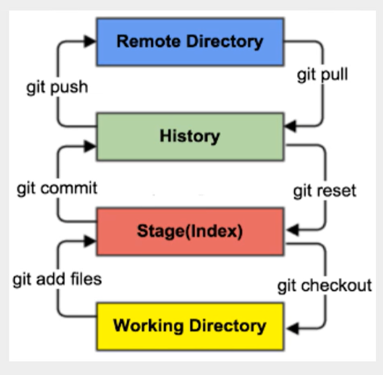
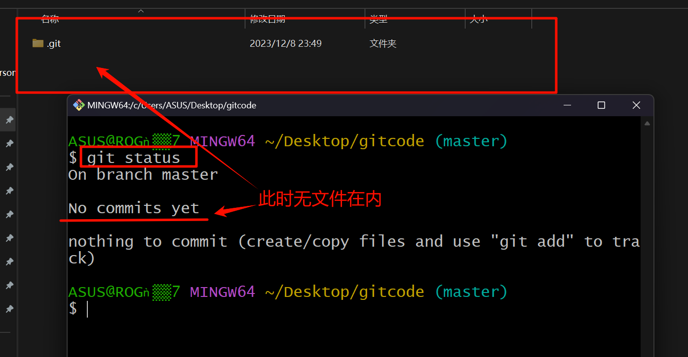
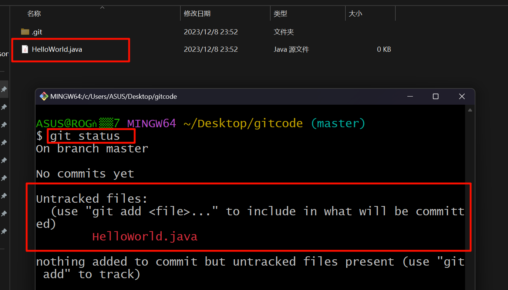
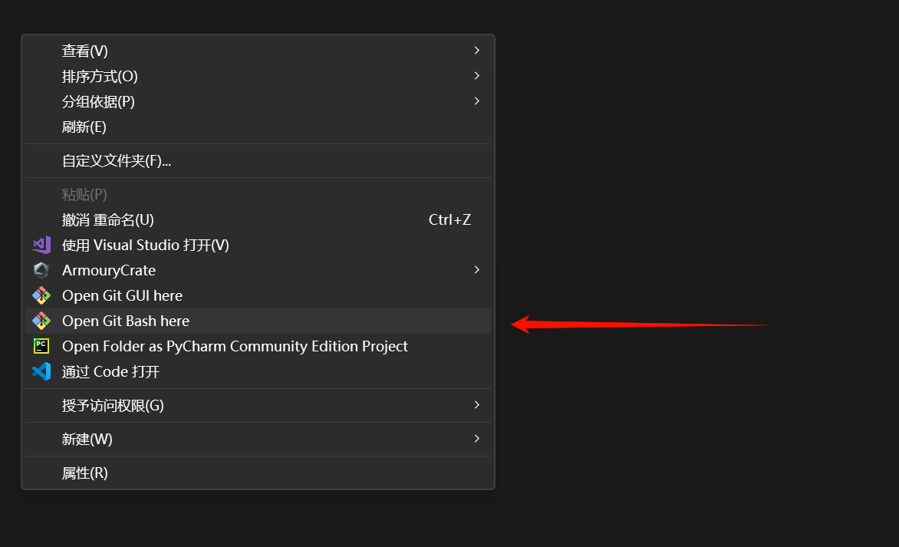
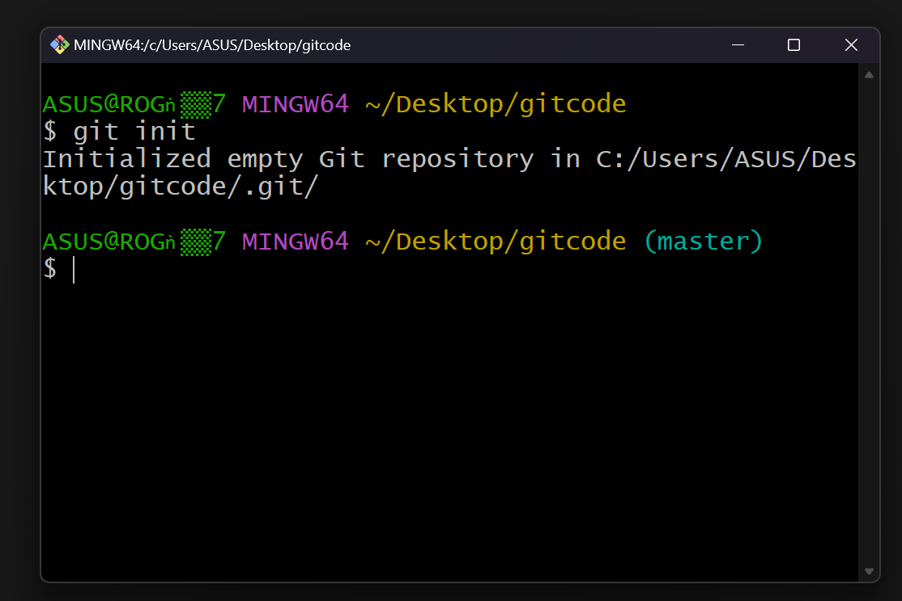
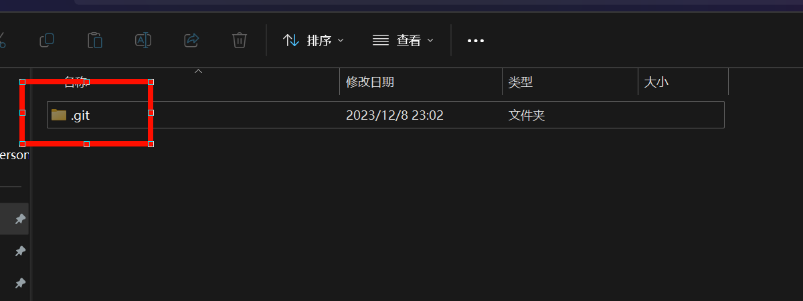
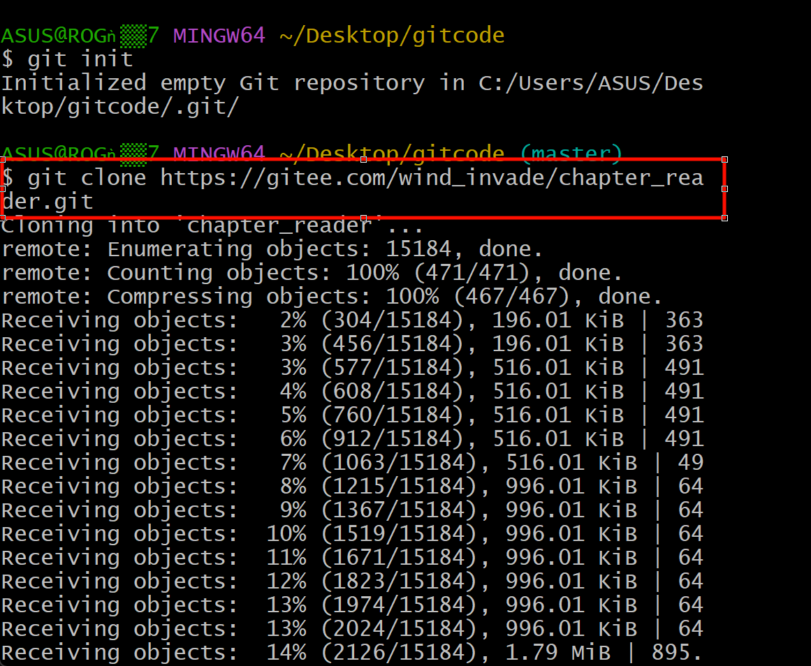
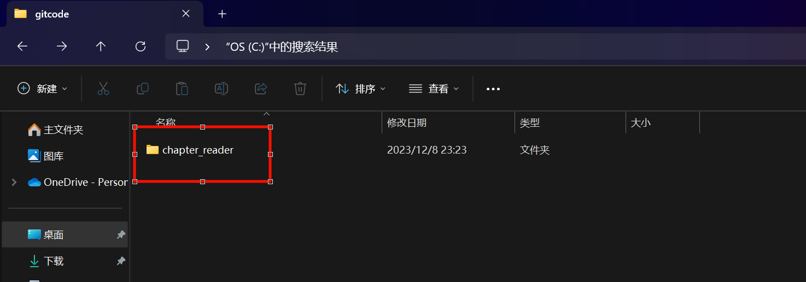
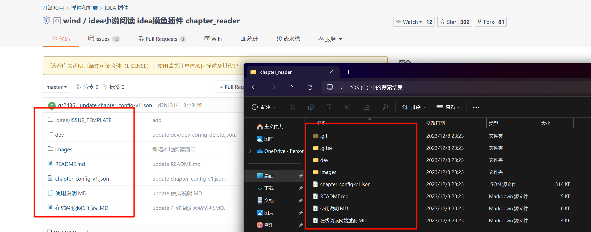

# Git教程

---

## 一、下载Git
1. 软件下载: [git官网](https://git-scm.com/download/)
    (备用网站: [淘宝镜像站](http://npm.taobao.org/mirrors/git-for-windows/))
2. 软件卸载:直接反安装即可
    1) 先找到环境变量检查并清除Git变量.
    2) 在控制面版--卸载程序里,将Git卸载.
3. Git完成之后:
    1) Git Bash: Unix与Linux风格的命令行,使用最多,推荐最多.
    2) Git CMD: Windows风格的命令行.
    3) Git GUI: 图形界面的Git,不建议初学使用.

---

## 二、常用Linux命令
1. 盘符切换
    [盘符名称]+[:]
    例如C:
2. 查看当前路径下的内容
    dir
3. 进入单级目录
    cd+[space]+[文件夹]
4. 回退到上一级目录
    cd ..
5. 进入多级目录
    cd+[space]+[目录1]+[\]+[目录2]+[\]+[目录...]
    例如cd D\7-Zip
6. 回退到盘符目录
    cd \
7. 清屏
    clear
8. 退出命令提示符窗口
    exit
9. 显示当前所在目录的路径
    pwd
10. 列出当前目录
    ls/ll (ll列出的内容更加详细)
11. 新建一个文件
    touch+[space]+[文件名.后缀]
12. 删除一个文件
    rm+[space]+[文件名.后缀]
13. 新建一个文件夹/目录
    mkdir+[space]+[文件夹名]
    例如mkdir test
14. 删除一个文件夹/目录
    [rm -r]+[space]+[文件夹名]
    例如rm -r test
15. 移动指定文件到目录
    mv+[space]+[文件名.后缀]+[space]+[文件夹名]
    例如mv start.c test
16. 重新初始化终端/清屏
    reset
17. 查看命令历史
    history
18. 帮助
    help

---

## 三、Git配置
1. 查看配置
    git config -l(字母的l)
2. 查看系统指定的配置
    git config --system --list
3. 查看用户自行设置的配置
    git config --global --list
4. 设置用户名称和电子邮件地址
    1) 设置用户名称: git config --global user.name "[输入用户名称]"
        例如:git config --global user.name "XZhao"
    2) 设置电子邮件地址: git config --global user.email [电子邮件名]
        例如:git config --global user.email 3536679390@qq.com
5. Git相关配置文件的保存目录
    在Git安装目录下的gitconfig: Git\etc\gitconfig

---

## 四、Git基本理论(**核心部分**)
1. Git本地有三个工作区域：**工作目录**（Working Directory）、**暂存区**(Stage/Index)、**资源库**(Repository或Git Directory)。如果再加上远程的**git仓库**(Remote Directory)就可以分为四个工作区域。文件在这四个区域之间的转换关系如下:

2. 区域详解:
    * Workspace:工作区,就是你平时存放项目代码的地方
    * Index／Stage:暂存区，用于临时存放你的改动,事实上它只是一个文件，保存即将提交到文件列表信息
    * Repository:仓库区（或本地仓库）,就是安全存放数据的位置,这里面有你提交到所有版本的数据.其中HEAD指向最新放入仓库的版本
    * Remote:远程仓库，托管代码的服务器，可以简单的认为是你项目组中的一台电脑用于远程数据交换
3. Git的工作流程
    1) 工作目录中添加、修改文件
    2) 需要进行版本管理的文件放入暂存区域
    3) 暂存区域的文件提交到git仓库
    * 因此,git管理的文件有三种状态:已修改(modified),已暂存(staged),已提交(committed)
4. Git文件的4种状态
    * 版本控制就是对文件的版本控制，要对文件进行修改、提交等操作，首先要知道文件当前在什么状态，不然可能会提交了现在还不想提交的文件，或者要提交的文件没提交上。
    1) Untracked:未跟踪,此文件在文件夹中,但并没有加入到git库,不参与版本控制.通过git add状态变为staged.
    2) Unmodify:文件已经入库,未修改,即版本库中的文件快照内容与文件夹中完全一致.这种类型的文件有两种去处,如果它被修改,而变为Modified.如果使用git rm移出版本库,则成为Untracked文件.
    3) Modified:文件已修改,仅仅只是修改,并没有进行其他的操作.这个文件也有两个去处,通过git add可进入暂存staged状态,使用git checkout则丢弃修改过,返回到unmodify状态,这个git checkout即从库中取出文件,覆盖当前修改.
    4) Staged:暂存状态.执行git commit则将修改同步到库中,这时库中的文件和本地文件又变为一致,文件为Unmodify状态.执行git reset HEAD filename取消暂存,文件状态为Modified.
5. 查看指定文件状态
    在Git Bash控制台中输入"git status [文件]"以查询该文件状态(不输入文件即为查询全部)
    示例1: 
    示例2: 
6. 忽略文件
    * 有些时候我们不想把某些文件纳入版本控制中，比如数据库文件，临时文件，设计文件等
    * 在主目录下建立".gitignore"文件，此文件有如下规则：
        1) 忽略文件中的空行或以井号(#)开始的行将会被忽略
        2) 可以使用Linux通配符。例如:星号（*）代表任意多个字符，问号(?)代表一个字符，方括号([abc])代表可选字符范围，大括号（{string1,string2...}）代表可选的字符串等。
        3) 如果名称的最前面有一个感叹号(!)，表示例外规则，将不被忽略。
        4) 如果名称的最前面是一个路径分隔符(/)，表示要忽略的文件在此目录下，而子目录中的文件不忽略。
        5) 如果名称的最后面是一个路径分隔符(/)，表示要忽略的是此目录下该名称的子目录，而非文件(默认文件或目录都忽略)
    示例: 
        (1)"*.txt" 表示忽略所有txt结尾的文件
        (2)"!lib.txt" 表示不被忽略

---

## 五、Git项目搭建(实操步骤)
### 第一步方法一:初始化本地仓库
1. 选择一空文件夹,在该页面右键找到"Open Git Bash here"
    如图: 
2. 在打开的界面中进行初始化仓库,即输入"git init"
    如图: 
    此时该路径就会生成一个.git隐藏文件夹(如下图)
    
### 第一步方法二:在网上克隆他人仓库到自己仓库中
1. 该步同方法一1.
2. 打开代码网站进行克隆(这里以码云作为例子):
    点击克隆,复制网址(url): 
3. 在Git Bash操作界面输入"git clone [复制的网址]",然后就能进行克隆操作
    
    待克隆完成后,页面就会出现克隆好的文件夹. 
    可以看到被克隆的与本地仓库的内容一致: 
### 第二步:将文件进行提交
