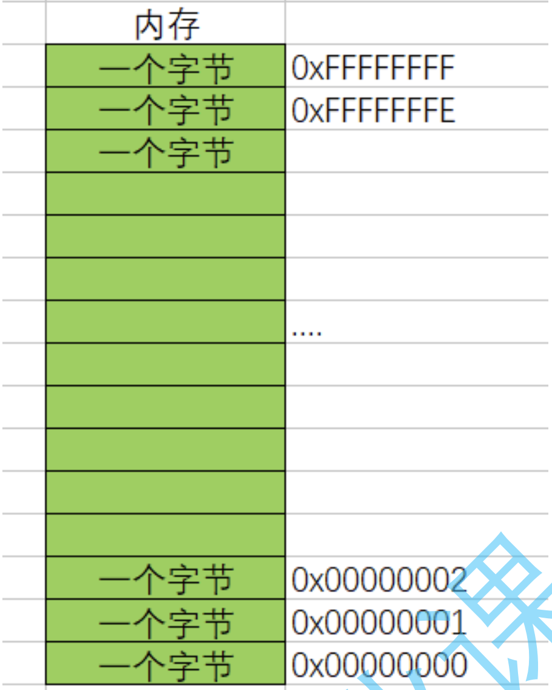
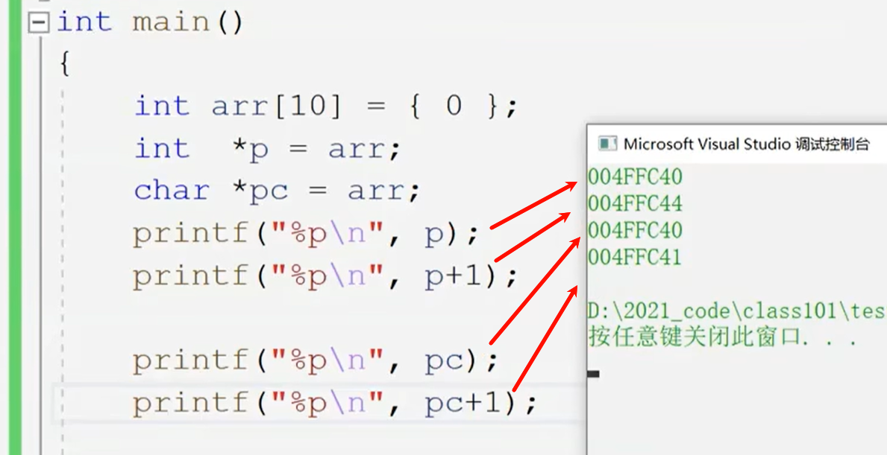
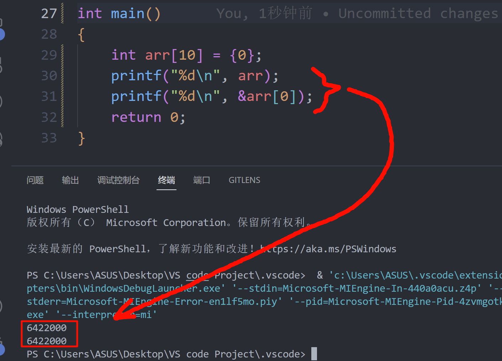
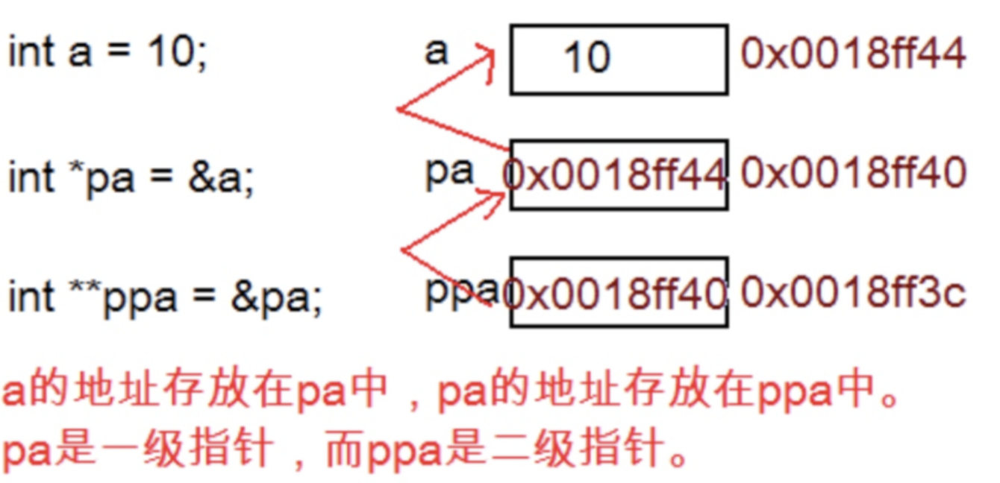

# C语言学习笔记

---

---

1. 一种预处理指令，以免在输入scanf时报错(如下)
   `#define  _CRT_SECURE_NO_WARNINGS 1`

2. 基础的变量算数程序(如下)

```C
#define  _CRT_SECURE_NO_WARNINGS 1
#include <stdio.h>
int main()
{
 double a1, b2, c3, sum;
 scanf("%lf%lf%lf", &a1, &b2, &c3);        //这里会被系统认定为是不安全的数据，因此需要第一行的代码
 sum = a1 * b2 / c3;
 printf("%f",sum);  
 return 0;
}
```

3. scanf在使用时可能会被编译器认为是不安全的代码，需要改为 `scanf_s`或是在第一行加上1.的语句.
   
4. if语句下如果只是跟一条语句时不需要加上{}，两句及以上则需要.
   
5. 关于字符数组的说明
   (1)字符串就是一串字符——用双引号括起来的一串字符.
   (2)字符串在结尾的时候隐藏了一个\0的字符，例如“hello”有6个元素.
   (3)"\0"是字符串的结束标志，但是在计算字符长度的时候不做字符内容.

6. 关于数组的定义和引用(如下)

```C
#include <stdio.h>
int main()
{
 int arr[5] = { 0,2,4,6,8 }; 
 //上面这一行数组名称为arr，该数组包含5个整型元素
 int i = 0;
 while (i < 5)
 {
  printf("%d\n", arr[i]);
  i++;
 }
 return 0;
}
```

```text
数组定义方式：数组名[常量表达式]
值得注意的是——这里数组arr中，各个元素所对应的序号应是从0开始而不是从1开始
打印arr中的第3个元素（4），引用的应该为arr[2]
```

7. 关于sizeof的讲解(如下)

```C
#include<stdio.h>
int main()
{
   int a = 10;
   int b = 20;
   int dic[4] = { 2,3,5,7 };
   printf("%d\n", sizeof(a));
   printf("%d\n", sizeof a );       //同上一行代码一个意思，但是a可以不用带括号
   printf("%d\n", sizeof(b));
   printf("%d\n", sizeof b );       //同上上一行一样
   printf("%d\n", sizeof(int));     //计算int类型所占的大小
   printf("%d\n", sizeof(dic));     //4个元素也是4个变量，计算的是数组中所有元素所占的字节
   printf("%d\n", sizeof(int [10]));//int [10]是arr数组类型
   return 0;
}
```

```text
sizeof的作用：计算类型或变量或数组的大小.
这串代码说明了sizeof为一个单目操作符而不是函数,后面跟变量时可以不用加括号.
结果上来说除了最后一行输出的都是4,因为一个整型变量需要占4个字节（1字节=8bit）.
在sizeof中放的表达式是不参与运算的,也不会修改变量的类型.
```

8. 关键字
   由C语言提供的关键字，但是不能由自己创建.

9. define的作用
   (1)定义常数。如#define ABC 1000 （这里不需要等号）.
   (2)定义宏。如#define ADD(X,Y) X+Y，在后面再次使用宏时，直接把字符替换成数字即可（如4+7）.
   *注：*
   (1)定义宏的时候（拿上一行做例子），在(X+Y)后面的式子中， X+Y与((X)+(Y))是有区别的.
   (2)不加括号会默认按照数学里的四则运算进行.
10. switch语句

```C
#include <stdio.h>
int main()
{
	char grade;
	scanf("%c", &grade);
	printf("Your score:");
	switch (grade)
	{
	   case 'S':printf("perfect"); break;
	   case 'A':printf("good");    break;
	   case 'B':printf("bad");     break;
	   case 'C':printf("worst");   break;
	   default:printf("ERROR");
	}
	return 0;
}
```

```text
值得注意的是：在执行一个case语句后，应当用break语句使流程跳出switch结构，即终止运行
不过最后一个case不需要break，因为switch结构已经结束.
```

---

11. 函数的组成(示例如下)

```C
ret_type fun_name(para1, *)
{
   statement;//语句项
}
//ret_type   ——>返回类型
//fun_name   ——>函数名
//para1      ——>函数参数
//大括号整体称为函数体
```
12.  操作符
    分类:算术操作符,移位操作符,位操作符,赋值操作符,单目操作符,关系操作符,逻辑操作符,条件操作符,逗号操作符,下标引用、函数调用和结构成员.
13.  算术操作符: + - * / %
    (1)除了 % 操作符之外,其他的几个操作符可以作用于整数和浮点数.
    (2)对于 / 操作符如果两个操作数都为整数,执行整数除法.而只要有浮点数执行的就是浮点数除法.
    (3)% 操作符的两个操作数必须为整数.返回的是整除之后的余数.

14.  原码,补码与反码
    (1)原码:直接根据数值写出的二进制序列就是原码.
    (2)反码:原码的符号位不变,其他位按位取反就是反码.
    (3)补码:反码 +1 就是补码.
    (4)对于正整数来说,原码、反码、补码相同;负数如下示例:

```txt
举例:
十进制数-1
原码: 1000000000000000000000000000001
反码: 1111111111111111111111111111110
补码: 1111111111111111111111111111111
```

---

15. 移位操作符: 左移操作符"<<" 和右移操作符">>"
    (1)左移操作符的作用是把变量的二进制位向左移动一位;右移操作符相反.
    (注:此行为不会直接改变原变量的值)
    (2)左移操作符
    过程为:左边抛弃,右边补0(逻辑左移)
    (3)右移操作符
    a.算术右移:右边丢弃,左边补原符号位
    b.逻辑右移:右移丢弃,左边补0
    * 右移操作符采用的是算术右移
      注:不能移动负数位.

16. 位操作符: 按位与"&", 按位或"|", 按位异或"^"
    (1)按位与
    两个二进制位都是1才输出1,有一个0就输出0.
    (2)按位或
    两个二进制位有一个是1就输出1,都是0才输出0.
    (3)按位异或
    a.两个二进制位相同输出为0,相异输出为1.
    b.`a^0`的结果为a; `a^a`的结果为0. (变量a为整数).
    注:他们的操作数必须是整数.

```text
示例:
a =    十进制位:3
       二进制位:00000000000000000000000000000011
b =    十进制位:5
       二进制位:00000000000000000000000000000101

a & b =十进制位:1
       二进制位:00000000000000000000000000000001
a | b =十进制位:7
       二进制位:00000000000000000000000000000111
a ^ b =十进制位:6
       二进制位:00000000000000000000000000000110
```

17. 赋值操作符: "=", "+=", "-=", "*=", "/=", "<<=", "%="  ......
    (1)除去"=",其它都是复合赋值.
    (2)赋值操作符可以连续赋值,例如 `z=y=x+1`.

18. 单目操作符
    (1)包含:逻辑反操作"!", 负值"-", 正值"+", 取地址"&", 操作数的类型长度(以字节为单位)"sizeof", 对一个数的按位取反" ~ ", 自加"(前置/后置) ++", 自减"(前置/后置) --", 直接引用操作符(解引用操作符)" * ", 强制类型转换"()".
    (2)逻辑反操作"!": 0的逻辑反操作为1,非0的逻辑反操作为0; 常跟在变量或"="前面.
    (3)操作数的类型长度(以字节为单位)"sizeof": 详见第7条.
    (4)按位取反"~": 将该变量的补码转换成反码.
    (5)取地址操作符"&": 读取变量.
    (6)直接引用操作符(解引用操作符)"*": 又成为间接访问操作符,**放在变量前,使指针变量间接地控制地址对应的变量**.

19. 变量的存储形式
    变量在内存中以补码的形式存储.因此在二进制运算的时候要先将原码转换成补码的形式.

20. 转义字符

| 转义字符 |                        释义                        |
| :------: | :------------------------------------------------: |
|   \\?    | 在书写连续多个问号时使用，防止他们被解析成三字母词 |
|   \\'    |                 用于表示字符常量'                  |
|   \\"    |           用于表示一个字符串内部的双引号           |
|   \\\    |  用于表示一个反斜杠，防止它被解释为一个转义序列符  |
|    \a    |                   警告字符，蜂鸣                   |
|    \b    |                       退格符                       |
|    \f    |                       进纸符                       |
|    \n    |                        换行                        |
|    \r    |                        回车                        |
|    \t    |                     水平制表符                     |
|    \v    |                     垂直制表符                     |
|   \ddd   |  d d d表示一个1~3个八进制的数字.如: \130表示字符X  |
|   \xdd   |    d d表示2个十六进制数字。 如： \x30 表示字符0    |

21. C语言常用的库函数有:
    (1)IO函数.
    (2)字符串操作函数.
    (3)内存操作函数.
    (4)时间/日期函数.
    (5)数学函数.
    (6)其他库函数.
    * 自定义函数与库函数一样，都有函数名、返回值类型和参数函数，但前者需要我们自己设置，自由度较大.

22. 数组
    (1)数组由数据类型相同的一系列元素组成.

    ```C
    /* 一些数组声明*/
    int main(void)
    {
        float candy[365];      /* 内含365个float类型元素的数组 */
        char code[12];         /*内含12个char类型元素的数组*/
        int states[50];        /*内含50个int类型元素的数组 */
        ...
    }
    ```
    (2)要访问数组中的元素，通过使用数组下标数(也称为索引1)表示数组中的各元素。数组元素的编号从θ开始，所以 `candy[θ]`表示candy数组的第1个元素,`candy[364]`表示第365个元素，也就是最后一个元素.
    (3)数组通常被用来存储程序需要的数据.例如:一个内含12个整数元素的数组可以存储12个月的天数;在这种情况下，在程序一开始就初始化数组比较好.
    (4)只存储单个值的变量有时也称为标量变量(scalar variable).具体如下:

    ```C
    int fix =1;
    float flax = PI * 2;//PI为宏
    ```
    (5)**使用const声明数组**
    有时需要把数组设置为只读.这样,程序只能从数组中检索值,不能把新值写入数组.要创建只读数组，应该用const声明和初始化数组.
    (6)数组的初始化
    a.在创建数组并明确元素个数的时候,应该尽量对其初始化(因为在不同的编译器上可能会报错).
    b.如果初始化数组时省略方括号中的数字,编译器会根据初始化列表中的项数来确定数组的大小.
    (7)指定初始化器
    a.指定初始化器是C99标准的一个新特性,利用该特性可以初始化指定的数组元素.例如:`int arr[6] = {[5] = 212};  //把arr[5]初始化为212`.
    b.可以利用指定初始化,进行较为复杂的初始化(如下)

    ```C
    // designate.c -- 使用指定初始化器
    #include <stdio.h>
    #define MONTHS 12
    int main(void)
    {
        int days[MONTHS] = { 31, 28, [4] = 31, 30, 31, [1] = 29 };
        int i;

        for (i = 0; i < MONTHS; i++)
            printf("%2d  %d\n", i + 1, days[i]);

        return 0;
    }
    ```
    ```txt
    该程序在支持C99的编译器中输出如下：
    1    31
    2    29
    3    0
    4    0
    5    31
    6    30
    7    31
    8    0
    9    0
    10    0
    11    0
    12    0
    ```
    以上输出揭示了指定初始化器的两个重要特性:第一，如果指定初始化器后面有更多的值，如该例中的初始化列表中的片段：[4]=31,30,31 ,那么后面这些值将被用于初始化指定元素后面的元素.也就是说,在days[4]被初始化为31后，days[5]和days[6]将分别被初始化为30和31。第二，如果再次初始化指定的元素，那么最后的初始化将会取代之前的初始化.例如，程序清单10.5中，初始化列表开始时把days[1]初始化为28，但是days[1]又被后面的指定初始化[1]=29初始化为29.

23. 指针初级
    (1)指针是什么?
    a.指针是内存中一个最小单元的编号，也就是地址.
    b.平时口语中说的指针，通常指的是指针变量，是用来存放内存地址的变量.

    * 具体地说,在计算机科学中,**指针**是编程语言中的一个对象,利用地址,它的值直接指向存在电脑存储器中另一个地方的值.由于通过地址能找到所需的变量单元,可以说,地址指向该变量单元.因此,将地址形象化地称为"指针".意思是通过它能找到以它为地址的内存单元.
      可以这样理解: 
      指针实际使用如下:

    ```C
    int main()
    {
        int a = 10;         //a在这里占4个字节
        int* pa = &a;       //拿到的是a的4个字节中第一个字节的地址
        //a变量占用4个字节的空间,这里是将a的4个字节的第一个字节的地址存放在p变量中,p就是一个之指针变量.
        *pa = 20;           //通过*pa直接修改a的值
        return 0;
    }
    ```
    (2)指针的定义:**[变量类型]+[ * ]+[space]+[名称]**
    a. char* 类型的指针是为了存放char类型变量的地址.
    b. short* 类型的指针是为了存放short类型变量的地址.
    c. int* 类型的指针是为了存放int类型变量的地址.
    * 注意:数组名本身就是一个地址.在定义时可以不用&.
      (3)指针的大小: 在32位平台是4个字节,在64位平台是8个字节.与指针变量类型无关.
      示例如下:

    ```C
    int main()
    {
        int* pa;
        char* pc;
        float* pf;
        printf("%d\n", sizeof(pa));
        printf("%d\n", sizeof(pc));
        printf("%d\n", sizeof(pf));
        //它们的输出结果都是4/8.
    }
    ```
    (4)指针的类型: 与变量类型相同.
    (5)指针类型的意义:
    a.指针类型决定了指针解引用的权限有多大(根据变量的限制类型来决定)
    b.指针类型决定了指针走一步能走多远(步长/字符长度)
    c. 使用对应的与使用不对应的指针变量: 造成这样的原因是字符型变量只占一个字节,+1相当于跳过一个字符长度;而整型变量占4个字节,+1相当于跳过一个整型长度.因而两者的差距体现在字符长度上.
    * 整型指针+1，等于跳过一个整型;字符指针+1,等于跳过一个字符;数组指针+1,等于跳过一个数组......

24. 野指针
    (1)概念:野指针就是指针指向的位置是不可知的（随机的、不正确的、没有明确限制的）
    (2)野指针的成因:
    A.指针未初始化(如下代码)

    ```C
    #include <stdio.h>
    int main()
    {   
        int *p;     //局部变量指针未初始化，默认为随机值
        *p = 20;    //指针非法访问内存
        return 0;
    }
    ```
    B.指针越界访问(如下代码)

    ```C
    #include <stdio.h>
    int main()
    {
        int arr[10] = {0};
        int *p = arr;
        int i = 0;
        for(i = 0; i <= 10; i++)
        {
            //当指针指向的范围超出数组arr的范围时，p就是野指针
            *(p++) = i;
        }
         return 0;
    }
    ```
    C.指针指向的空间释放
    原本指针变量指向的变量被内存清除了,该指针就成为了野指针.
    举例:租一个房子一天,"我"记住了房子的地址,但是第一天之后房子无效了,地址也就没有用了.
    (3)如何规避野指针
    A.指针初始化
    B.小心指针越界
    C.指针指向空间释放置NULL
    D.指针使用之前检查有效性
    * 注意:C语言本身是不会检查数据的越界行为的

25. 指针运算
    (1)指针-整数
    在指针运算中可以加或减去整数以此得到其它元素的值.也可以借此显示其它元素对应的值.
    如下示:

    ```C
    #define N_VALUES 5
    float values[N_VALUES];
    float *vp;
    //指针+-整数；指针的关系运算
    for (vp = &values[0]; vp < &values[N_VALUES];)
    {
        *vp++ = 0;
    }
    ```
    (2)指针-指针
    数组中通过指针减去指针能得到指针之间元素的个数.
    如下示:

    ```C
    int my_strlen(char* s)
    {
        char *p = s;
        while(*p != '\0')
            p++;
        return p-s;
    }

    int main()
    {
        int len = my_strlen("abc");
        printf("%d\n",len);
        return 0;
    }
    ```
    * 注:指针和指针相减的前提是两个指针指向同一块空间
      (3)指针的关系运算(代码如下)

    ```C
    for(vp = &values[n_VALUES]; vp > &values[0];)
    {
        *--vp = 0;
    }
    ```
    * 实际在绝大部分的编译器上是可以顺利完成任务的，然而我们还是应该避免这样写，因为标准并不保证它可行.

26. 指针与数组
    (1)开头示例:

    ```C
    #include <stdio.h>
    int main()
    {
        int arr[10]={ 0 };
        printf("%d\n", arr);
        printf("%d\n", &arr[0]);
        return 0;
    }
    ```
    可见输出为: 

    ```txt
    说明数组名和数组首元素的地址是一样的,即 `int* p = &arr[0]`与 `int* p = arr`作用相同
    ```
    (2)指针提供一种以符号形式使用地址的方法.因为计算机的硬件指令非常依赖地址，指针在某种程度上把程序员想要传达的指令以更接近机器的方式表达.数组表示法其实是在变相地使用指针.
    (3)可以把数组的值赋给指针变量,然后可以修改指针变量的值.
    (4)我们的系统中，地址按字节编址，short类型占用2字节，double类型占用8字节。**在C中，指针加1指的是增加一个存储单元 .对数组而言，这意味着加1后的地址是下一个元素的地址，而不是下一个字节的地址** *(见下代码)*,这就是为什么必须声明指针所指向对象类型的原因之一.只知道地址不够，因为计算机要知道存储对象需要多少字节（即使指针指向的是标量变量，也要知道变量的类型，否则*pt就无法正确地取回地址上的值）.
    ```C
    #include <stdio.h>
    #define SIZE 4
    int main(void)
    {
         short dates[SIZE];
         short * pti;
         short index;
         double bills[SIZE];
         double * ptf;
         pti = dates;    // 把数组地址赋给指针
         ptf = bills;
         printf("%23s %15s\n", "short", "double");
         for (index = 0; index < SIZE; index++)
              printf("pointers + %d: %10p %10p\n", index, pti + index, ptf + index);
         return 0;
    }
    ```
    ```txt
    输出如下:
                     short          double
    pointers + 0: 0x7fff5fbff8dc 0x7fff5fbff8a0
    pointers + 1: 0x7fff5fbff8de 0x7fff5fbff8a8
    pointers + 2: 0x7fff5fbff8e0 0x7fff5fbff8b0
    pointers + 3: 0x7fff5fbff8e2 0x7fff5fbff8b8
    ```
    * 从这里也可以看出指针区分类型的意义.

27. 二级指针/多级指针
    (1)引入:指针变量也是变量，是变量就有地址,那指针变量的地址存放在哪里?所以就有了二级指针.
    (2)指针也算是变量,所以也有自己的地址,示例图:
    (3)对于二级指针的运算有:
    ```C
     int a = 10; int* pa = &a; int** ppa = &pa; **ppa=30;   
     //此时就代表着ppa间接地控制了a的值. //**ppa先通过*ppa找到pa,然后对pa进行解引用操作:*pa，那找到的是a. 
    ```
    (4)以此类推,这样的操作可以得到多级指针.

28. 指针数组
    (1)指针数组是存放指针的数组.
    (2)指针数组中的每一个元素都是一个整型指针.

29. 建立结构声明
    (1)结构声明(structure declaration)描述了一个结构的组织布局.类似下面代码:
    ```C
    struct book
    {
        char title[10];
        char author[10];
        float value;
    };
    ```
    ```txt
    该声明描述了一个由两个字符数组和一个float类型变量组成的结构.该声明并未创建实际的数据对象,只描述了该对象由什么组成.
    ```
    (2)首先是关键字struct，它表明跟在其后的是一个结构，后面是一个可选的标记（上面例中是book），稍后程序中可以使用该标记引用该结构.
    (3)所以，在后面的程序中可以这样声明: `struct book library;` 这把library声明为一个使用book结构布局的结构变量.
    (4)在结构声明中,用一对花括号括起来的是结构成员列表.每个成员都用自己的声明来描述.例如上面的代码，title部分是一个内含10个元素的char类型数组.成员可以是任意一种C的数据类型,甚至可以是其他结构!右花括号后面的分号是声明所必需的,表示结构布局定义结束.可以把这个声明放在所有函数的外部（如本例所示）,也可以放在一个函数定义的内部.**如果把结构声明置于一个函数的内部，它的标记就只限于该函数内部使用.如果把结构声明置于函数的外部，那么该声明之后的所有函数都能使用它的标记**.
    (5)程序的另一个函数中,可以这样声明: `struct book dickens;` 这样,该函数便创建了一个结构变量dickens,该变量的结构布局是book.结构的标记名是可选的.但是以程序示例中的方式建立结构时(在一处定义结构布局,在另一处定义实际的结构变量),必须使用标记.

30. 
