# Java笔记

---

## 一.常用cmd指令

---

1. 盘符切换
   [盘符名称]+[:]
2. 查看当前路径下的内容
   dir
3. 进入单级目录
   cd+[space]+[文件夹]
4. 回退到上一级目录
   cd..
5. 进入多级目录
   cd+[space]+[目录1]+[\]+[目录2]+[\]+[目录...]
   例如cd D\7-Zip
6. 回退到盘符目录
   cd \
7. 清屏
   cls
8. 退出命令提示符窗口
   exit
9. 文件夹中含有隐藏的文件夹:{.}和{..},与文件夹的级数有关
10. 配置环境变量的原因
    为了能在任意的目录下都能打开指定的文件,就可以把软件的路径配置到环境变量中
11. 添加环境变量
    在文件管理器中右键,点击[属性],随后点击左栏的[高级系统设置]进入系统属性,点击[高级],再点击[环境变量];看见系统变量后,选中[Path]进行[编辑],在里面[新建],将完整路径粘贴到里面,全点[确定].
    或者打开设置,点击[系统],再点[系统信息],找到[高级系统设置]并进入,-->[环境变量],之后同上.
12. Java配置Path环境变量
    依据11.在系统变量下新建变量,[变量名]随意填写,而[变量值]填写到Java文件夹[bin]的上级目录(不包括bin文件).例如变量名为[JAVA_HOME],随后在环境变量[Path]中新建,填入[%]+[变量名]+[%\bin].

---

## 二.Java入门

---

1. Java的下载
   [Java官网](https://www.oracle.com/)

2. Java JDK的安装目录介绍
   (1) **bin**:该路径下存放了各种工具命令(重点).
   (2) conf:该路径下存放了相关配置文件.
   (3) include:该路径下存放了一些平台特定的头文件.
   (4) jmods:该路径下存放了各种模块.
   (5) legal:该路径下存放了各模块的授权文档.
   (6) lib:该路径下存放了工具的一些补充JAR包.

3. Hello World案例编写
   (1) 用记事本编写程序
   a.创建一个新的记事本文件,并修改后缀名称为java.
   b.用记事本打开并编辑(如下):

   ```java
   public class HelloWorld{
   		public static void main(String[] args){
   				System.out.println("Hello World");
   		}
   }
   ```

   c.打开cmd进行对java文件的编译运行(下面都是在cmd命令中)
   将路径修改为Java文件所在路径(切换盘符).
   (2) 翻译文件
   a.输入javac+[空格]+[文件名.java],若无出现提示则没有问题.
   b.此时在该目录下会出现一个相同名字但后缀是".class"的文件.
   (3) 运行程序
   随后输入java+[空格]+[文件名]就能输出内容.

4. 编写代码时
   (1) 注意大小写"System"严格输入.
   (2) 对.class文件进行运行时不写后缀.

5. Java工具介绍
   (1) javac
   javac是JDK提供的编译工具,可以把java文件编译成class文件.
   (2) java
   java是JDK提供的运行工具,可以运行当前路径下的class文件,不过在运行时不加后缀.

6. Java关键字
   (1) 含义被Java赋予了特定含义的英文单词.
   (2) 常用的代码编辑器,针对关键字有特殊的颜色标记.
   (3) 关键字的字母全部小写.

7. 基本数据类型
   (1) 整数:byte,short,int,long
   (2) 浮点数:float,double
   (3) 字符:char
   (4) 布尔:boolean

   | 关键字  | 内存占用(字节) |
   | :-----: | :------------: |
   |  byte   |       1        |
   |  short  |       2        |
   |   int   |       4        |
   |  long   |       8        |
   |  float  |       4        |
   | double  |       8        |
   |  char   |       2        |
   | boolean |       1        |

   注:(1)如果要定义一个long类型变量,那么在初始化时后面要加上大写或小写的"L".
   (2)如果要定义一个float类型变量,那么在初始化时后面要加上大写或小写的"F".

8. 不同进制在代码中的表现形式
   (1) 二进制:由0和1组成,在代码中以 0b 开头.
   (2) 十进制:由0 ~ 9组成,前面不加任何前缀.
   (3) 八进制:由0 ~ 7组成,在代码中以 0 开头.
   (4) 十六进制:由0 ~ 9和a ~ f组成,在代码中以 0x 开头.

9. Java 对象和类
   (1)Java作为一种面向对象语言.支持以下基本概念：多态,继承,封装,抽象,类,对象,实例,方法,重载
   (2)对象:对象是类的一个实例,有状态和行为.例如,一条狗是一个对象,它的状态有:颜色,名字,品种;行为有:摇尾巴,叫,吃等.
   (3)类:类是一个模板,它描述一类对象的行为和状态.
   例如:汽车为类(class),而具体的每辆车为该汽车类的对象(object),对象包含了汽车的颜色,品牌,名称等.
   (4)在软件开发中,方法操作对象内部状态的改变,对象的相互调用也是通过方法来完成.

10. 字符串的"+"操作
    (1)当"+"操作中出现字符串时,这个"+"是字符串连接符,而不是算术运算符了.此时会将前后的数据进行拼接,并产生一个新的字符串.(例: 123+"123" 会输出为 "123123" ).
    (2)连续进行"+"操作时,从左到右**逐个**执行.
    [例1: 1+99+"年时光" 会输出为 "100年时光". ]
    [例2: 1+2+"abc"+2+1 会输出为 "3abc21". ]

11. 逻辑运算符
    (1)逻辑运算符与C语言中的不太一样,逻辑与为"&",逻辑或为"|"
    (2)短路逻辑运算符
    a.短路与:"&&", 结果与"&"相同,但是有短路效果.
    b.短路或:"||", 结果与"|"相同,但是有短路效果.
    * 短路效果:当符号左边的表达式不成立时,右边就不再参与运算.(作用:提高代码运行效率)
  
12. 数组的长度
    (1)在Java中,关于数组的一个长度属性:length.
    (2)调用方式:[数组名]+[.length].
13. 数组的地址值
    (1)数组的地址值表示数组在内存中的位置.
    (2)"[": 表示当前是一个数组.
    (3)"D": 表示当前数组里面的元素都是double类型的.
    (4)"@": 表示一个间隔符号(固定格式).
    (5)"27716f4": 表示数组真正的地址值(以十六进制表示).

* 地址值表示如下:

```Java
package java;
public class Experience {
    public static void main(String[] args) {
        int arr[] = { 1, 2, 3 };    //注:int[] arr也是可以的
        System.out.println(arr);
    }
}
```

14. 数组动态初始化
    (1)概念: 动态初始化:初始化时只指定数组长度,由系统为数组分配初始值.
    (2)格式: [数组类型[]]+[space]+[数组名]=[new ]+[数据类型+数组长度].
    例: `int[] arr = new int[3];` (给arr初始化3个元素)
    (3)数组默认初始化值的规律:
    a.整数类型:默认初始化为0.
    b.小数类型:默认初始化为0.0.
    c.字符类型:默认初始化为'\u0000'(空格).
    d.布尔类型:默认初始化为false.
    e.引用初始化类型:默认初始化为null.
    (4)好处: 数组会被自动初始化.

15. Java内存分配:栈,堆,方法区,本地方法栈,寄存器.
    * 注意:JDK8开始,取消方法区,新增元空间.把原来方法区的多种功能进行拆分,有的功能放到了堆中,有的功能放到了元空间中.
   (1)栈:方法运行时使用的内存,比如main方法运行,进入方法栈中执行.
      栈内存:程序的主入口(main方法)开始执行时会进栈,代码执行完毕会出栈.
      示例: 
   (2)堆:存储对象或者数组,new来创建的,都存储在堆内存.
      堆内存:
         a.new出来的东西会在这块内存中开辟空间并产生地址.
         b.如果没有new的情况,就不需要堆内存.
         c.只要new出来的一定是在堆内存里开辟了一个空间
         d.如果new了多次,那么在堆里有多个小空间,每个小空间中都有各自的数据.
   * 堆内存中假设开辟了数组地址arr(代码为`int[] arr = new int[2];`),那么`new int[2]`就会将自身的地址传给在内存中的`int[] arr`,这样arr就能通过地址找到在栈内存中的new.输出时,就是在栈内存通过地址找到堆内存中的new并进行返回输出.结构图示例: 
   * 两个数组指向同一个小空间时,其中一个数组对小空间中的值发生了改变,那么其他数组再次访问的时候都是修改之后的结果了.相当于同一个数组有两个不同名字. 示例图:  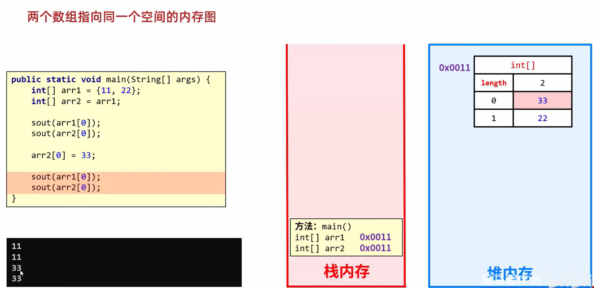
   (3)方法区:存储可以运行的class文件.
   (4)本地方法栈:JVM在使用操作系统功能的时候使用,与开发无关.
   (5)寄存器:给CPU使用,与开发无关.

16. 类
    类可以包含以下类型变量：
    (1) 局部变量:在方法、构造方法或者语句块中定义的变量被称为局部变量.变量声明和初始化都是在方法中,方法结束后,变量就会自动销毁.
    (2) 成员变量：成员变量是定义在类中,方法体之外的变量.这种变量在创建对象的时候实例化.成员变量可以被类中方法、构造方法和特定类的语句块访问.
    (3)类变量:类变量也声明在类中,方法体之外,但必须声明为 static 类型.
    (4) 一个类可以拥有多个方法,在上面的例子中: eat(), run(), sleep() 和 name() 都是 Dog 类的方法.

```java
public class Dog {
    String breed;
    int size;
    String colour;
    int age;
 
    void eat() {
    }
 
    void run() {
    }
 
    void sleep(){
    }
 
    void name(){
    }
}
```

17. 方法(类似于C语言的函数)
   (1)什么是方法?
      方法(method)是程序中最小的执行单元
      方法的概念如图: 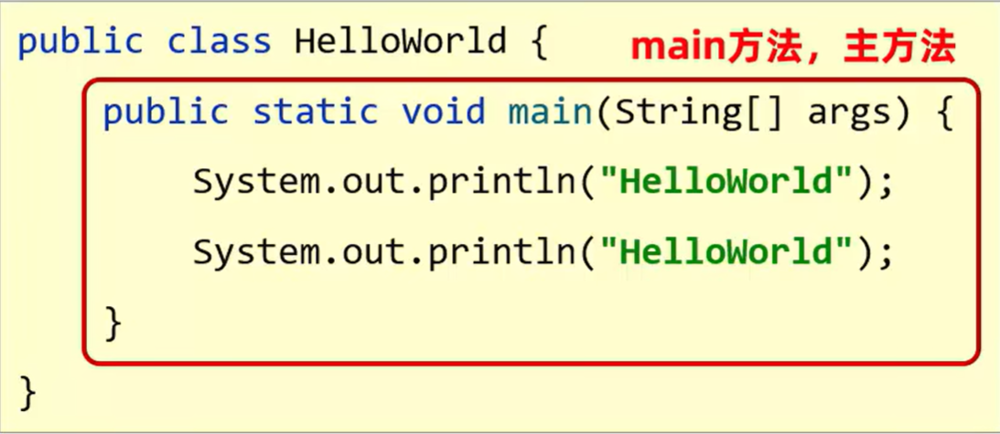
   (2)方法的作用:a.提高代码的复用性;   b.提高代码可维护性.
   (3)方法的格式
      把一些代码**打包**在一起，用到的时候就**调用**
      A.方法定义:把一些代码打包在一起，该过程称为方法定义.
         方法的定义格式:
            a.最简单的方法定义
            b.带参数的方法定义
            c.带返回值方法的定义(返回值只需用return即可)
         示例图1: 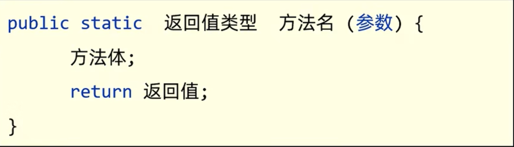
         示例图2：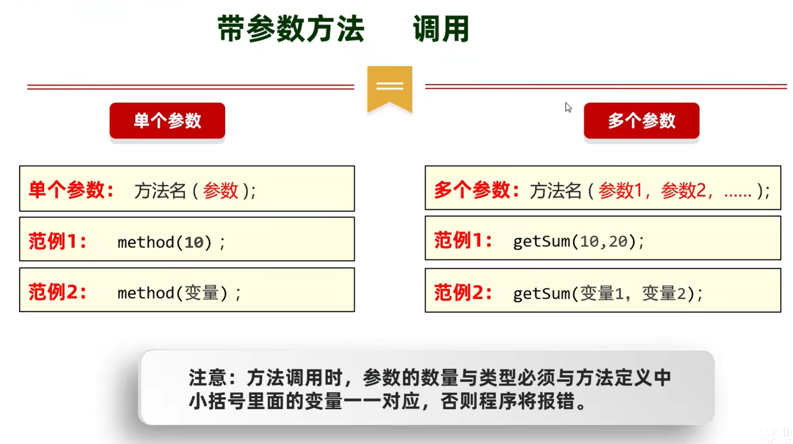
      B.方法调用:方法定义后并不是直接运行的，需要手动调用才能执行，该过程称为方法调用.
         调用示例如图: 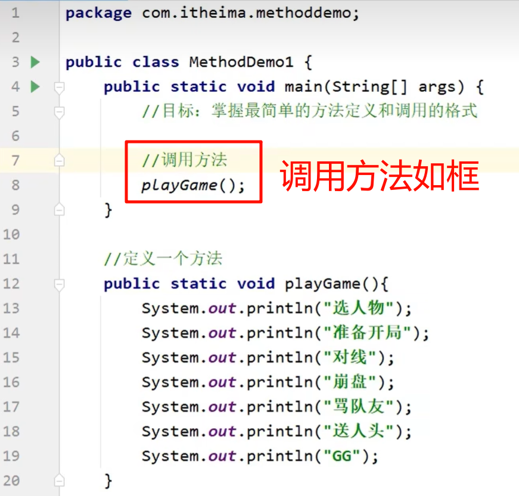
   (4)方法的重载
      A.在同一个类中，定义了多个同名的方法，这些同名的方法具有同种的功能.
      B.每个方法具有不同的参数类型或参数个数，这些同名的方法，就构成了重载关系.
   (5)方法的内存
      A.方法在内存中遵循着"先进后出"的原则,即最先调用的最后出栈.

18. 基本数据类型和引用数据类型
   * 其中基本数据类型:整数,浮点数,布尔,字符类型;引用数据类型是除基本数据类型外的其它所有类型.
   (1)只要是new出来的,都算是引用数据类型.
      如图: 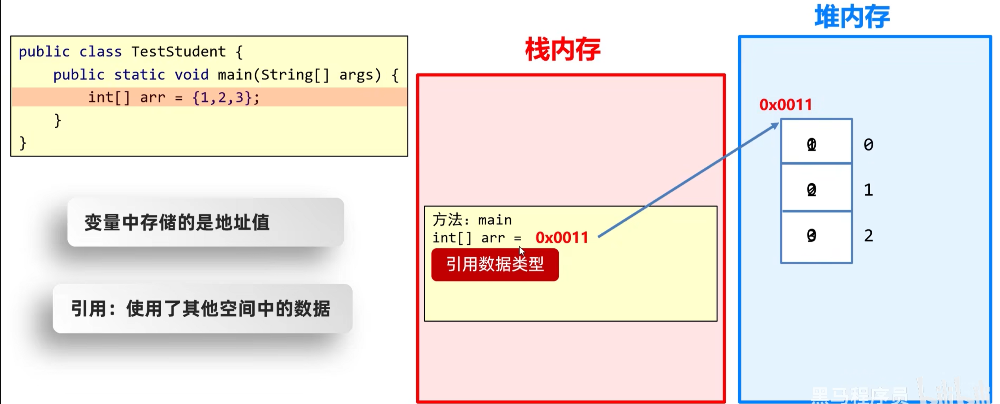
   (2)从内存的角度去解释:
      A.基本数据类型:数据值是存储在自己的空间中
      特点：赋值给其他变量，也是赋的真实的值.
      B.引用数据类型:数据值是存储在其他空间中,自己空间中存储的是地址值
      特点:赋值给其他变量,赋的地址值.
   * 基本数据类型和引用数据类型的差别(如下图):
      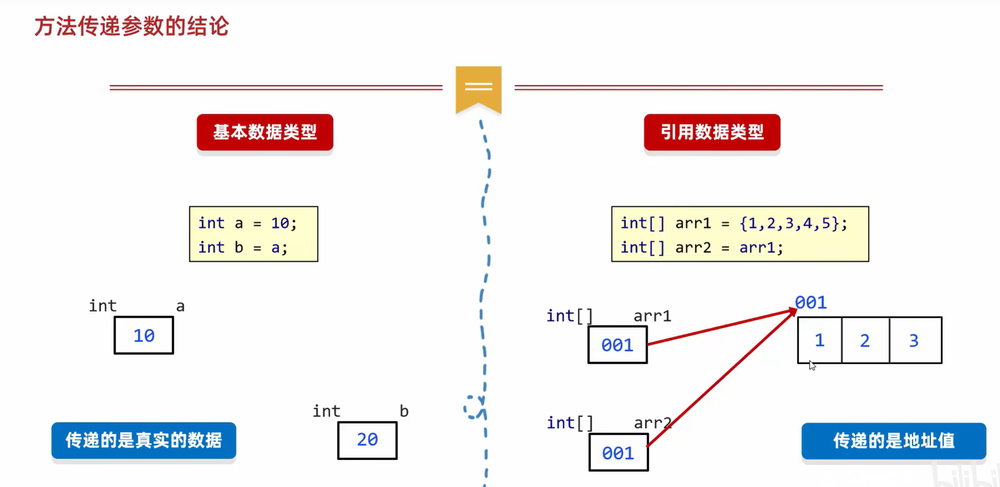

19. 面向对象初级
   (1)面向:拿,找
   (2)对象:能干活的东西
   (3)面向对象编程:拿东西过来做对应的事情
   (4)面向对象的重点学习什么?
      a.学习获取已有对象并使用
      b.学习如何自己设计对象并使用->涉及到面向对象的语法
20. 类与对象
   (1)设计对象并使用
      A.类和对象
         a.类:是对象共同特征的描述(设计图).
         b.对象:是真实存在的具体东西.
      * 在Java中，必须先设计类，才能获得对象
         c.如何定义类?(如图) 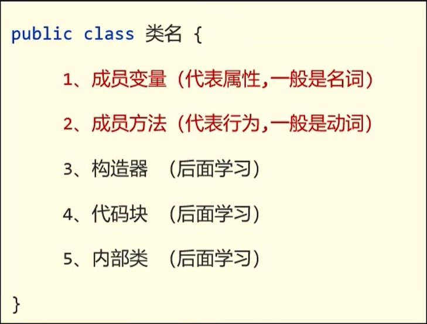
            创建类如图(它们都是在同一个文件夹下): 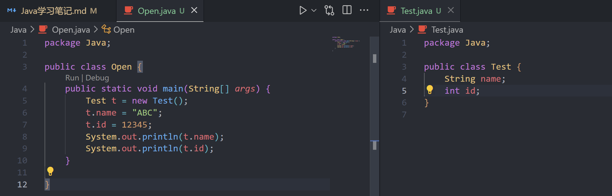
         d.对象名定义方式:**类名 对象名 = new 类名();**
         e.拿到对象后能做什么?   **对象.成员变量/对象.成员方法(...)**
      B.类的几个补充注意事项
         a.用来描述一类事物的类,专业叫做:Javabean类.
            在Javabean类中,是不写main方法的.
         b.在之前,编写main方法的类,叫做测试类.
            我们可以在测试类中创建javabean类的对象并进行赋值调用.
         c.在Javabean类中,可以编写属性和行为来描述一类事物
            图例: 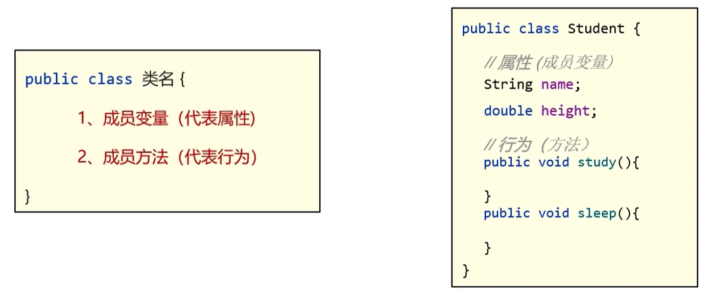
         d.类名首字母建议大写，需要见名知意.
         e.一个Java文件中可以定义多个class类,且只能一个类是public修饰,而且public修饰的类名必须成为代码文件名.**实际开发中建议还是一个文件定义一个class类.**
         f.成员变量的完整定义格式是: **修饰符 数据类型 变量名称 = 初始化值;**  在类中一般无需指定初始化值,存在默认值.

   * 具体代码如下:
   ```java
   //注意:它们都要放在同一个文件夹中(这里演示为Java文件夹)
   //类设置
   package Java;

   public class Test {
    String name;
    int id;
   }

   //对象设置
   package Java;

   public class Open {
    public static void main(String[] args) {
        Test t = new Test();
        t.name = "ABC";
        t.id = 12345;
        System.out.println(t.name);
        System.out.println(t.id);
      }
   }
   ```

   (2)封装
      A.封装告诉我们,如何正确设计对象的属性和方法.
      B.封装规定:对象代表什么，就得封装对应的数据，并提供数据对应的行为
      * 例如:人关门,在Java里是"门自己关的",相当于是门的状态被改变: 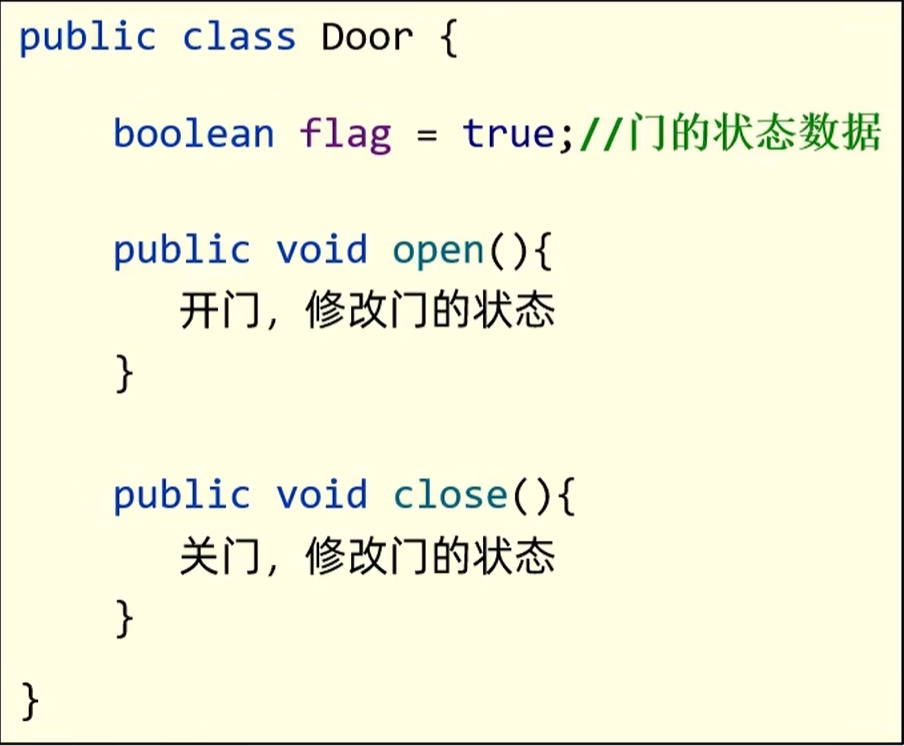
   (3)private关键字
      A.是一个权限修饰符
      B.可以修饰成员（成员变量和成员方法）:`public [成员变量名];`
      C.被private修饰的成员只能在本类中才能访问
      D.需要通过对变量的操作筛选允许特定成员变量的访问
   (4)this关键字
   (5)构造方法
   (6)标准JavaBean
   (7)对象内存图
   (8)补充知识:成员变量、局部变量区别


---

## 三.Java的大致发展情况

---

1. Java发展史(大概)
   (1) 1995年Java语言诞生
   (2) 2004年Java第一个大版本5.0
   (3) Java 8.0为市面上大部分公司使用版本
2. Java类别
   (1) Java SE:Java语言的基础,用于桌面应用的开发
   (2) Java ME:Java语言的小型版,用于嵌入型电子设备或者小型移动设备
   (3) Java EE:Java语言的企业版,用于Web方向的网站开发
3. Java能做什么?
   (1) 桌面应用开发:各种税务管理软件,IDEA,Clion,Pycharm.
   (2) 企业级应用开发:微服务,springcloud.
   (3) 移动应用开发:鸿蒙,Android,医疗设备.
   (4) 科学计算:matlab.
   (5) 大数据开发:Hadoop.
   (6) 游戏开发:Minecraft.

---

## 四.写Java格式代码

---

1. 注释
   (1) 单行注释://注释内容
   (2) 多行注释:/* 注释内容 */
   (3) 文档注释:/** 注释内容 */

2. 字面量
   (1)字面量就是告诉程序员数据在程序中的书写格式
   (2)字面量类型大致与C语言变量类型相似,但有布尔类型、空类型.
   (3)字符串类型:用双引号括起来的,内容可以为一句话,一个单词等;
   字符类型:用单引号括起来的,其中内容只能有一个字符;
   空类型:一个特殊的值,空值,为null.不能够直接打印.
   (4)特殊字面量:\t,\n等等,可以用单引号括起来.

3. 键盘录入(Scanner)
   (1)导包(Scanner这个类在哪?):`import java.util.Scanner;`
   导包的动作必须出现在类定义的上边(此步与python的引用差不多).
   (2)创建对象(表示要开始用Scanner这个类了):Scanner sc =new Scanner(System.in);
   上面这个格式里面,只有bl是变量名可以变,其他都不允许变(可以只输一次).
   (3)接收数据(真正开始干活):int bl = sc.nextInt();
   上面这个格式里面,只有bl是变量名可以变,其他都不允许变.

```java
import java.util.Scanner;

public class Experience {
    public static void main(String[] args) {
        System.out.println("请输入一个整数:");
        Scanner bl = new Scanner(System.in);
        int i = bl.nextInt();
        System.out.print("i的值为");
        System.out.println(i);
    }
}
```

4. 输出/打印
   (1)输出语句不换行:`System.out.print();`
   (2)输出语句后换行:`System.out.println();`

5. if语句
   * 大致与C语言相同,只是细微之处有区别:
     if的括号内可以直接跟布尔型变量(但不常用).

6. Switch语句
   (1)表达式:(将要匹配的值)取值为byte,short,int,char.
   注:JDK5以后可以是枚举,JDK7以后可以是String.
   (2)case后面的值只能是字面量,不能是常量.
   (3)case给出的值不能重复.
   (4)case穿透:如果其中一个case匹配上,那么后面的case语句都会执行,直到遇到break;
   作用:可以多执行后面的语句,此时代码比if语句更简洁.
   * 具体的范例如下:

```Java
//标准格式:
switch(表达式){
   case <值1>:
      <语句体1>;
      break;
   case <值2>:
      <语句体2>;
      break;
   case <值3>:
      <语句体3>;
      break;
   ......
   default:
      <语句体n>;
}

//Java内格式(需要一定版本支持:JDK12及以上):
switch(表达式){
   case <值1> ->{
      <语句体1>;
   }
   case <值2> ->{
      <语句体2>;
   }
   case <值3> ->{
      <语句体3>;
   }
   ......
   default -> {
      <语句体n>;
   }
}
//只有1行语句时可不用{}

```

7. 随机数(Random)
   (1)导包(Random):`import java.util.Random;`
   导包的动作必须出现在类定义的上边(此步与python的引用差不多).
   (2)创建对象(表示要开始用Random这个类了):Random r =new Random();
   上面这个格式里面,只有r是变量名可以变,其他都不允许变(可以只输一次).
   (3)接收数据(真正开始干活):int Random.Index = r.nextInt(bound:5);
   上面这个格式里面,r是变量名可以变,数字"5"可以变,其他都不允许变.
